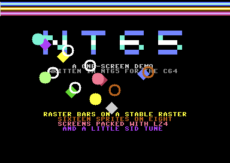

# A C64 demo

A one-screen demo for the Commodore 64 in the manner of the ones its scene made, written for
nt65 from the start: colour bars in the top border on a stable raster, sixteen sprites shown
with the VIC-II's eight, a screen and its colours unpacked from LZ4, and a tune played on the
SID. It is small, a little over two kilobytes, because it is there to try nt65 on code whose
timing matters, rather than to show off.



The screen is text, unpacked once at the start. In the top border, 24 lines each draw one colour
of the bars, on the same cycle of every line. Three kinds of object move over the screen: four
balls that bounce off its edges, six rings that go round in two circles, and six diamonds that
swim to the left and bob as they go. An object that comes within a sprite's height of the one
eight before it, in order down the screen, is not shown in that frame, as with any multiplexer
this simple. The tune is a loop of sixteen steps on three voices: a lead on the pulse waveform,
a bass on the sawtooth and a drum on noise.

The demo is timed for a PAL machine, which is what VICE's `x64sc` emulates unless it is told
otherwise. It never goes back to BASIC.

## Building

With `nt65`, `ca65` and `ld65` on the path, in PowerShell:

```text
./build.ps1
```

`build/demo.prg` is the program, with a debug file beside it that points at the `.nt65`
sources and a label file for VICE's monitor. The script first runs `tools/pack.ps1`, which packs
`screens/title.txt` and `screens/colours.txt` into `build/screens`, where `src/screens.nt65`
includes them, so nt65 can read their sizes. From a build of this repository, with the pinned
cc65 in `.cache/cc65`, run from the repository's root:

```text
examples/c64-demo/build.ps1 -Nt65 src/Norristown.Cli/bin/Debug/net10.0/nt65.exe -Ca65 .cache/cc65/bin/ca65.exe -Ld65 .cache/cc65/bin/ld65.exe
```

## Running it

`x64sc build/demo.prg` loads the program and runs it. `-moncommands build/demo.lbl` gives VICE's
monitor the program's names as well, so `d raster__stable` there disassembles the routine that
draws the bars.

## Testing it

`./test.ps1` runs the demo in VICE for a hundred frames and checks what it left in memory. It
takes about a second. VICE stops the demo at the top of its main loop once the frames have
passed, saves the whole of memory and a screenshot, `build/test/demo.png`, and leaves through
its debug cartridge. A run that never gets there stops after 20 million cycles, and fails. The
autostart's random delay is turned off, so every run is the same run. The checks are:

- **screen** and **colours**: screen memory and colour memory are what `tools/pack.ps1` packed,
  which tests the decruncher against the packer.
- **sorted**: `plex::order` holds every object once, from the top of the screen down.
- **stable**: in every frame, the bars start on the same cycle of their line. A checkpoint with
  a condition on VICE's cycle count leaves VICE with an exit code of its own when they do not.
- **state**: the frame count, the music's step, the SID's registers and the objects' places are
  as `tests/expected.txt` has them.

`./test.ps1 -Update` writes `tests/expected.txt` from the run instead of checking it, which is
then read and checked by hand. `-Vice` names `x64sc` when it is not on the path.

## Organization of the program

- `src/main.nt65`: the start, which unpacks the screen and sets everything up, and the main loop,
  which moves and sorts the objects once a frame.
- `src/raster.nt65`: the raster interrupts, in the order a frame takes them, which the comment
  at its top lists. `bottom` goes on into the KERNAL's own handler, through the address that
  `install` found in CINV, which keeps the keyboard and the jiffy clock going once a frame.
- `src/plex.nt65`: the sprite multiplexer, the table of objects, the handler for each kind, and
  the shapes.
- `src/lz4.nt65`: the decruncher, most of which runs in the zero page.
- `src/music.nt65`: the music driver and the tune.
- `src/screens.nt65`: the packed screen and colours.
- `src/c64.nt65`: the registers of the VIC-II, the SID and the CIAs, the SID's voice as a
  record, and the KERNAL's interrupt entry.
- `src/stub.nt65`: the load address and the BASIC line `10 SYS2061`.
- `c64.cfg`: the linker configuration. The program loads where BASIC programs do, its variables
  and the decruncher take the zero page BASIC leaves, and the code that counts cycles is in a
  segment of its own on a page boundary.
- `tools/pack.ps1`: the packer, a greedy LZ4 compressor, and the conversion of the text files to
  the bytes the C64 shows.

### A frame

| Line | Interrupt | Does |
|---|---|---|
| 16 | `raster::top` | asks for `stable` two lines on, and runs `nop`s until it comes |
| 18 | `raster::stable` | starts within a cycle of the same point, takes that cycle out, draws the bars on lines 19 to 42, and shows the first eight objects |
| as asked | `plex::irq` | shows each later object when the sprite it takes over comes free |
| 250 | `raster::bottom` | plays the music, counts the frame and runs the KERNAL's handler |

The main loop waits for the frame count to change, then moves every object and sorts them. That
is done before `stable` shows the first objects of the next frame.

## What it shows of nt65

- **Code whose timing is checked.** The bars' loop takes 63 cycles a line, and an `.assert` on
  `.mincycles` and `.maxcycles` says so: if an instruction is added or taken out, the build
  fails. The one cycle more that the loop could cost is a page crossed by the read of the colour
  table, and an `.assert` on the table's address rules it out, as another does for the branch
  back. The code starts a page with `.align 256`, so that both hold as the code before it grows. The
  wait in `stable` before it reads the raster is checked the same way, against the cycle VICE
  shows the interrupt arriving on, so that the read lands on the last cycle of the line.
- **Chaining through a vector.** `raster::install` patches the KERNAL's interrupt vector at
  `$0314` and keeps the old one. `bottom` leaves with `jmp (old)` and `.next ?`, which says the
  path goes where nt65 cannot follow. Each handler is an `interrupt` routine, and the KERNAL's
  exit, which returns from the interrupt, is declared as one too.
- **A struct of arrays.** The objects' table is a family of data, one array of `OBJECTS` bytes
  for each member of the `Field` enum, declared with `.each`, so `objects::ypos,x` is object X's
  Y. The objects start from a table of records of the `Object` struct, and `init` copies each
  record into the arrays with an `.each` over the same enum, which names the record's field and
  the array alike. An `.assert` keeps the struct and the enum in step.
- **A handler for each kind.** The table of handlers is built with `.each` over the `Kind` enum,
  and `move` reaches them through an `rts`, which `.next handlers` follows. The shapes are drawn
  by `.func`s, one for each kind.
- **Self-modifying code.** `plex::show` writes the sprite's number into the operands of the two
  stores that need it, the colour's and the pointer's, and `.patch` marks each store. The
  decruncher keeps its pointers in the operands of its own instructions, and moves them on with
  `inc`, with a `.patch` after each.
- **Code that runs where it was not loaded.** The decruncher's segment loads with the rest of
  the program and runs in the zero page, as the linker configuration says. `lz4::install`
  copies it there, from `.loadof(UNPACK)` to `.runof(UNPACK)`, `.spanof(UNPACK)` bytes, and nt65
  reads the configuration, so it knows the code's labels are in the zero page and addresses them
  so.
- **A macro that measures what it is given.** `lz4::unpack!(screens::title, SCREEN)` writes the
  decruncher's pointers from the data it names and that data's `.endof`, so the length of the
  packed screen is never written down.
- **Data built as the program is compiled.** The tune is written as a tracker shows it, `E-4 ---
  G-4`, and `.func`s of `.strat` turn each cell into a note. The SID's frequency table is worked
  out from one octave's frequencies. The sine table is `.sin`, and the sprites' shapes are
  worked out a pixel at a time.
- **Records for the hardware.** The SID's three voices are `.data voices: .type Voice[3] =
  $D400`, so `sid::voices[p]::control` is the control register of voice p, and the music driver
  sets each part's voice with an `.each` over its parts.
