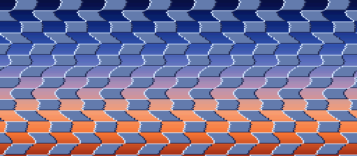

# A HiROM demo for the Super NES

A small Super NES program written for nt65 from the start, as a HiROM cartridge at FastROM speed.
A wall of blocks waves from side to side over a backdrop that shades from night to dusk down the
screen. Both are HDMA: one channel sets BG1's horizontal scroll on every line, and another sets
the backdrop's color. It is there to try nt65 on what a HiROM program does with its banks: code
and data in two banks of 64K, far calls between them, and the data bank moved to reach each.



## Building

With `nt65`, `ca65` and `ld65` on the path, in PowerShell:

```text
./build.ps1
```

`build/hirom-hdma.sfc` is the cartridge, with a debug file beside it that points at the `.nt65`
sources and a label file. The script writes the header's checksum once the image is linked.
From a build of this repository, with the pinned cc65 in `.cache/cc65`, run from the
repository's root:

```text
examples/hirom-hdma/build.ps1 -Nt65 src/Norristown.Cli/bin/Debug/net10.0/nt65.exe -Ca65 .cache/cc65/bin/ca65.exe -Ld65 .cache/cc65/bin/ld65.exe
```

## Running it

Any Super NES emulator runs `build/hirom-hdma.sfc`. In MAME, `mame snes -cart
build/hirom-hdma.sfc`.

## Testing it

`./test.ps1` runs the demo in MAME's Super NES for 150 frames and checks what it left. It takes
about a second. Once the demo has counted the frames, `session.lua` writes out the memory the test
reads and the screen, saves a snapshot, `build/test/snap/demo.png`, and leaves MAME. A run that
never gets there stops after a minute of the machine's time, and fails. The checks are:

- **wave**: HDMA channel 1 reads the table in bank $C1 of the buffer that `wave::shown` names,
  and reads that buffer's scrolls from bank $7E.
- **state**: the frame count, both HDMA channels' registers, the wave's two buffers, the
  backdrop's table and a hash of the screen are as `tests/expected.txt` has them.

`./test.ps1 -Update` writes `tests/expected.txt` from the run instead of checking it, which is
then read and checked by hand, against the snapshot too. `-Mame` names MAME, or the folder it is
in, when it is not on the path. MAME's ROMs for the Super NES are looked for beside it.

## Organization of the program

- `src/header.nt65`: the cartridge's header and vectors, and the stubs in bank $00 that the
  vectors point at, which jump on into bank $C0.
- `src/main.nt65`: the start, which sets the hardware up, the main loop, which works out the
  wave's next frame, and the NMI, which counts the frames and shows that frame.
- `src/video.nt65`: BG1's tiles, tilemap and palette, worked out as the program is built, and
  the DMAs that load them.
- `src/hdma.nt65`: the settings of the HDMA channels, and the routine that starts them.
- `src/wave.nt65`: the wave's tables, the two buffers of scrolls, and the routines that work a
  frame's scrolls out and show them.
- `src/gradient.nt65`: the backdrop's key colors, and the routine that works the table of a
  color for each line out from them.
- `src/snes.nt65`: the ports the demo uses, and the DMA channels' registers as a record.
- `hirom.cfg`: the linker configuration.

### Where everything is

| Bank | What is there | Seen from |
|---|---|---|
| $00, at $FF00 | the stubs, the header and the vectors | $40, $80, $C0 |
| $C0, first half | the tiles, the tilemap, the palette and the DMAs' settings | $40 |
| $C0, second half | the code that runs in bank $C0, and the HDMA settings | $00, $40, $80 |
| $C1 | the wave and the gradient: their code, their tables and the key colors | $41 |
| $7E | the wave's buffers and the backdrop's table | |
| $00, the first 8K | the direct page, the variables and the stack | $01 to $3F, $7E, $80 to $BF |

The `memory` of the link in `nt65.json` says which banks see each memory area, and `ranges`
says which see the ports. Most of the code runs with B at $80, which sees the ports, the first
8K of RAM and the second half of bank $C0. The first half of bank $C0 is read with long
addresses. `gradient::build` moves B to $7E, where it writes its table, and reads the key colors
with long addresses. `wave::build` moves B to $C1, where the waves are, and writes its buffer
with long addresses.

## What it shows of nt65

- **The banks are checked.** `nt65.json` links `hirom.cfg` and gives each of its memory areas
  the banks it is mirrored in, so nt65 knows where every segment lives and what each bank sees.
  An absolute operand is checked against the data bank where it runs: `lda frames` in
  `wave::build`, where B is $C1, is an error that names the bank; so is `lda load_map,x` in
  `video::setup`, where B is $80, and so is a port such as `channels[1]::address` written while
  B is $C1. A `jsr` from bank $C0 to `gradient::build` in bank $C1 is an error that says to use
  `jsl`.
- **Long jumps into another bank.** The vectors are sixteen bits, so a reset and an NMI start
  in bank $00. The stubs there jump long into bank $C0 to near routines, which nt65 allows
  because nothing returns through the jump: the reset stub's target never returns, and the NMI
  stub's is an interrupt handler. A long jump to a mirror, such as
  `jml ($80 << 16) | .loword(start)`, is checked against the mirrors of `start`'s segment.
- **Far calls and the data bank.** `gradient::build`, `wave::prepare`, `wave::build` and
  `wave::show` are `far`, in bank $C1, called with `jsl` from bank $C0 and left with `rtl`. Each
  says in its signature that it hands B back as $80, and the analysis follows `phb`, `phk`,
  `plb` and `lda #.bankbyte(ramp)`, `pha`, `plb` through each.
- **Data in its own widths.** The key colors are `.long`, 24-bit RGB as a paint program writes
  it, which `gradient::build` takes apart into the Super NES's five bits a part. The frame count
  is a `.dword`. The DMAs' settings are records with a `.faraddr` source.
- **Split tables of addresses.** The HDMA channels' tables are a `.list`, and the settings
  `hdma::start` writes are its `.lobytes`, `.hibytes` and `.bankbytes`, one byte to an effect,
  which an 8-bit index reads. The wave's channel is indirect, and the bank of its scrolls is
  `.bankbyte(wave::scrolls)`.
- **Hardware as data.** The DMA channels are `.mmio channels: .type Channel[8] = $4300`, so
  `channels[1]::address` is $4312, and `channels::mode,x` is the mode of the channel whose
  registers are at X.
