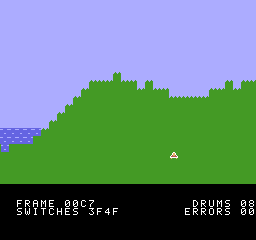

# An MMC3 cartridge for the NES

A small NES program written for nt65 from the start, on the mapper most NES games past the first
few years used: Nintendo's MMC3, on a TxROM board. It is there to show the patterns the MMC3
brings, and the mistakes they invite, rather than to be a game.



Hills and water scroll to the left across two nametables, a dot a frame, under a status bar that
stays still. The MMC3 raises an IRQ at the end of the playfield, whose handler maps the status
bar's font into the background's tiles and scrolls back to the left edge. The water moves because
the NMI maps a different one of four character banks every eight frames. A tune plays from
program banks the NMI maps for it: an arpeggio on a pulse channel, with a drum the DMC plays
from a sample. The ship moves left and right with the joypad.

The status bar counts the frames, the drums the tune has started, the main loop's rounds of bank
switches, and the errors those rounds found. The errors stay at 0, which is the point of the
program: see [Bank switches and interrupts](#bank-switches-and-interrupts).

## Building

With `nt65`, `ca65` and `ld65` on the path, in PowerShell:

```text
./build.ps1
```

`build/mmc3.nes` is the cartridge, an iNES file for mapper 4, with a debug file beside it that
points at the `.nt65` sources, and a label file. From a build of this repository, with the pinned
cc65 in `.cache/cc65`, run from the repository's root:

```text
examples/mmc3/build.ps1 -Nt65 src/Norristown.Cli/bin/Debug/net10.0/nt65.exe -Ca65 .cache/cc65/bin/ca65.exe -Ld65 .cache/cc65/bin/ld65.exe
```

## Running it

`mame nes -cart build/mmc3.nes` runs it in MAME, and any NES emulator that has the MMC3 runs
`build/mmc3.nes` as well. MAME's joypad is on the arrow keys.

## Testing it

`./test.ps1` runs the cartridge in MAME's NES for two hundred frames, with the joypad held right
for fifty of them, and checks what it did. It takes about a second. `test.lua` watches the bus
while the cartridge runs, and at the end saves the NES's RAM and a picture of the screen,
`build/test/mmc3.png`. The checks are:

- **split**: the IRQ's writes to PPUSCROLL come twice in every frame, always on the same line,
  which is one of the blank rows between the playfield and the status bar's text.
- **banks**: in every one of the main loop's rounds, thousands in all, each program bank it
  switched to was the one it asked for, while the interrupts switched banks under it.
- **drums**: the DMC read the whole sample once for each drum the tune started. The CPU never
  reads the sample, so every read of it is the DMC's.
- **status**: the status bar's text is what `status::update` writes from the counts.
- **state**: the frame count, the scroll, the ship, the tune's place, the status bar, the IRQ's
  line and a hash of the screen are as `tests/expected.txt` has them. How many rounds of switches
  the main loop makes depends on how long each takes, so the state leaves that count out, with
  the digits and the line of the screen that show it.

`./test.ps1 -Update` writes `tests/expected.txt` from the run instead of checking it, which is
then read and checked by hand against the picture. `-Mame` names MAME when it is not on the
path.

In MAME the IRQ's writes land on line 192, a line later than the NESdev wiki's account of the
hardware puts them. The program leaves two blank rows where they land, so the split is clean
either way, and the test's **split** check accepts any line of them. `tests/expected.txt` records
MAME's.

## Organization of the program

- `src/main.nt65`: the reset, the start, the main loop, the NMI and the IRQ. The comment at its
  top goes through a frame.
- `src/mmc3.nt65`: the MMC3's ports and registers, and the routines and macros that switch its
  banks through the shadows of its registers.
- `src/playfield.nt65`: the code that draws the playfield, in program bank 0, and the land's
  heights, in bank 3.
- `src/audio.nt65`: the tune's driver, in program bank 1, the tune, in bank 4, and the drum's
  sample, in the fixed bank at `$C000`.
- `src/status.nt65`: the code that writes the status bar's text, in program bank 2, and the text
  around its numbers, in bank 5.
- `src/joypad.nt65`: the joypad's read, which the DMC cannot spoil.
- `src/chr.nt65`: the character ROM: the font, the land's tiles, the water's four frames and the
  ship, each drawn as a picture.
- `src/nes.nt65`: the PPU's and the APU's ports.
- `src/header.nt65`: the iNES header and the vectors.
- `mmc3.cfg`: the linker configuration, which the comment at its top describes.

### The banks

| Bank | Runs at | Holds |
|---|---|---|
| 0 | `$8000` | `playfield`'s code |
| 1 | `$8000` | `audio`'s code |
| 2 | `$8000` | `status`'s code |
| 3 | `$A000` | the land's heights |
| 4 | `$A000` | the tune |
| 5 | `$A000` | the status bar's text |
| 6 | `$C000`, fixed | the drum's sample, the main code and its data |
| 7 | `$E000`, fixed | the reset and the vectors |

Each switchable bank starts with its own number. The character ROM is in 1K banks: the font in
0 and 1, the land's tiles in 2 and 3, the water's frames in 4 to 11, and the ship in 12.

## Bank switches and interrupts

The MMC3 switches a bank with two writes: one to `$8000` to choose a register, and one to
`$8001` to set it. An interrupt that comes between the two and switches a bank of its own
leaves `$8000` choosing its register, so the interrupted code's second write sets the wrong one.
Both of this program's interrupts switch banks, and the main loop spends most of each frame
switching program banks and checking that each is the one it asked for, so an interrupt comes
in the middle of a switch thousands of times a run.

The program keeps a shadow of `$8000`, and of the two program banks, and writes each shadow
before the register it shadows. An interrupt handler pushes the shadows before it switches
anything, and at its end maps back the program banks they name and writes the shadow of `$8000`
back to it. Whichever instruction the handler broke into, the code goes on to find `$8000` as
it left it. `mmc3.nt65`'s comment says why the order matters, and `push_banks!` and
`pull_banks!` are the two halves.

The protocol is tested by breaking it: with the IRQ's last write to `$8000` taken out, the test's
run counts errors in the main loop's checks within its two hundred frames.

## What it shows of nt65

- **Banks the linker configuration describes.** nt65 reads `mmc3.cfg` and knows that banks 0 to
  2 are alternatives at `$8000`, and banks 3 to 5 at `$A000`. Code in one of them that calls,
  jumps to, reads or writes anything in another bank at the same address is an error, so a
  `jsr playfield::draw` in `status`'s bank 2 is reported before anything is built, saying to go
  through the fixed bank. Code in bank 2 may read bank 5, at `$A000`, and does.
- **`.bankof`.** Every bank number in the program, program and character banks alike, is
  `.bankof(name)`, the `bank` that `mmc3.cfg` gives the memory area the name runs in, which ld65
  fills in. `lda #.bankof(status::update)` maps the bank `status::update` is in, wherever the
  configuration puts it. Each program bank's first byte is `.bankof` of itself, which the main
  loop reads back to check a switch, and an `.assert` checks that the byte is at the start.
- **Macros for a protocol.** `push_banks!` and `pull_banks!` are the two halves of an interrupt
  handler's care for the main thread's banks, written once in `mmc3.nt65`.
- **Data built as the program is compiled.** The font and every tile are pictures in the source.
  The land's heights are two waves of `.sin`. The tune's notes are frequencies, which `.muldiv`
  turns into the APU's periods, and the drum's sample is worked out a byte at a time.
- **Records for the hardware.** OAM is `.type Sprite[64]`, so the ship is `oam[0]::left`, and the
  tune is an array of `Step` records.
- **Distances as constants.** The status bar's text has a `.data` member at each number, and the
  number's place in the row is the distance from the start, worked out as nt65 compiles.

## What it leaves out

- **Sprite 0.** A sprite-0 hit is how a cartridge with no IRQ of its own splits the screen. The
  MMC3's IRQ does that job here, and nothing else in the program needs to know where the PPU has
  drawn to, so it has no use for one.
- **The DMC's IRQ.** The DMC can raise an IRQ when a sample ends, which would share the IRQ
  vector with the MMC3's. The tune starts each drum itself, so nothing waits for one to end, and
  the program leaves the DMC's IRQ off rather than invent a use for it. The test sees the sample
  play from the DMC's reads instead.
- **The MMC3's other modes and its RAM.** The program keeps the banking modes that fix banks 6
  and 7, and has no use for the 8K of RAM at `$6000` that some TxROM boards have.
