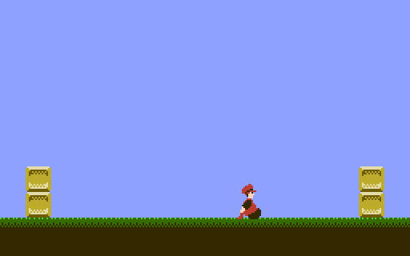

# SNROM template



Damian Yerrick's [snrom-template](https://github.com/pinobatch/snrom-template), a minimal
working program for the Nintendo Entertainment System using the SGROM, SNROM, UNROM or UOROM
board, ported to nt65. It is the game of [nrom-template], which lorom-template ports to the
Super NES as well, on a board with bank switching: a character scoots left and right across a
static background.

Additional concepts illustrated:

- initializing the MMC1
- loading tile data into CHR RAM
- calls from one PRG bank to another

[nrom-template]: https://github.com/pinobatch/nrom-template

## Building

With `nt65`, `ca65` and `ld65` on the path, and Python 3 with Pillow as `py`, `python3` or
`python`, in PowerShell:

```text
./build.ps1
```

`build/snrom-template.nes` runs on an SGROM or SNROM board, with the MMC1, and
`build/uorom-template.nes` on a UNROM or UOROM board. `-Nt65`, `-Ca65`, `-Ld65` and `-Python`
name the tools when they are not on the path. From a build of this repository, with the pinned
cc65 in `.cache/cc65`, run from the repository's root:

```text
examples/snrom-template/build.ps1 -Nt65 src/Norristown.Cli/bin/Debug/net10.0/nt65.exe -Ca65 .cache/cc65/bin/ca65.exe -Ld65 .cache/cc65/bin/ld65.exe
```

Every build converts the pictures in `tilesets/` into `build/assets` with the Python tool
upstream wrote, before nt65 runs, because nt65 measures every file an `.incbin` names. The two
images are two configurations of one program, `snrom` and `uorom` in `nt65.json`: each sets
the `mapper::MMC1` setting, which chooses the driver and its iNES header, and links its own
linker configuration. Both images are byte for byte what upstream's ca65 source builds with
the same cc65, and `build.ps1` compares them with `expected.sha256` and fails if either differs;
`-Update` accepts a change that is meant.

## Organization of the program

- `src/nes.nt65`: register definitions.
- `src/mapper.nt65`: the interface both drivers implement, and the `MMC1` setting that chooses
  one. Every other module reaches the driver through it.
- `src/mmc1.nt65`: iNES header and driver for MMC1, with the reset stub in each of the 16 PRG
  banks, since any bank may be switched in at power-on.
- `src/unrom.nt65`: iNES header and driver for UNROM and UOROM, whose last bank is fixed, so
  one reset stub serves.
- `src/init.nt65`: PPU and CPU I/O initialization code.
- `src/main.nt65`: main program, which runs in bank 4.
- `src/bankcalltable.nt65`: list of entry points called through a far call (one that goes from
  one bank to another), and `bankcall` and `bankrts`, which make one. Each entry is a record of
  the entry point less 1 and the bank it is in; `bankcall` switches to the bank, pushes the
  address and jumps there with `rts`, and its `.next` names the table, so nt65 follows the call
  to every entry point in it. Each of those leaves with `jmp bankrts`, which switches back to
  the caller's bank before it returns, and nt65 checks what the routine hands back through
  `bankrts`. `bankrts` declares `pulls 1`, the saved bank above the original caller's return
  address, so nt65 checks that it returns through that address.
- `src/chrram.nt65`: CHR RAM data setup, in bank 13.
- `src/bg.nt65`: background graphics setup.
- `src/player.nt65`: player sprite graphics setup and movement. The sprite is drawn in bank 2,
  to test the bankcall mechanism.
- `src/pads.nt65`: read the controllers in a DPCM-safe manner.
- `src/ppuclear.nt65`: useful subroutines for interacting with the PPU.
- `snrom2mbit.cfg` and `uorom2mbit.cfg`: the linker configurations, which `nt65.json` links. Each
  of the 15 switchable banks has a segment that runs at $8000, and the last bank's segments run
  at $C000.

`tools/pilbmp2nes.py` is the command-line program upstream wrote, in Python, to convert bitmap
images in PNG or BMP format into tile data usable by several classic video game consoles, and
`tools/convert.ps1` runs it.

## What the port changed

The linked images are byte for byte the upstream build. Where the source differs from
upstream's, it is for the following reasons.

- There is no `global.inc`: each module exports its own names, and the others bring them in
  with `.use`. `mmc1.inc` is `src/mapper.nt65`, which re-exports the chosen driver's names.
- The makefile links one driver or the other; nt65 builds a program from all of its sources,
  so each driver's contents stand under an `.if` of the `MMC1` setting, and the build links the
  object of the one that is written.
- `bankcall` and `bankrts` were the same in both drivers, which each kept a copy. They are in
  `src/bankcalltable.nt65` beside the table, once, where they land in the same place.
- The table's entries are records of a struct, `Entry`, rather than what a macro wrote, and
  each call's number, which the macro defined as its entry's offset, is the distance from the
  start of the table to the entry.
- The reset stubs are one macro called in a routine for each bank, since a macro cannot open a
  segment of its own.
- The scratch bytes at $00-$07 that routines use as locals are declared as data found there,
  as `.data srclo: .byte = 0`.
- `read_pads_once` is a routine of its own, after `read_pads`, rather than a label inside it.
- `USE_DAS` is a setting, declared with `?=` and set with `nt65 build -D pads::USE_DAS=1`.

## Greets

- [NESdev Wiki] and forum contributors
- [FCEUX] team
- Joe Parsell (Memblers) for getting me into NESdev in the first place
- Jeremy Chadwick (koitsu) for more code organization tips

[NESdev Wiki]: http://wiki.nesdev.com/
[FCEUX]: http://fceux.com/

## Legal

The demo is distributed under the following license, based on the GNU All-Permissive License,
which `LICENSE` reproduces and this port keeps. It is an altered version of the original, which
is at the address above.

> Copyright 2011-2016 Damian Yerrick
>
> Copying and distribution of this file, with or without modification, are permitted in any
> medium without royalty provided the copyright notice and this notice are preserved in all
> source code copies.  This file is offered as-is, without any warranty.
